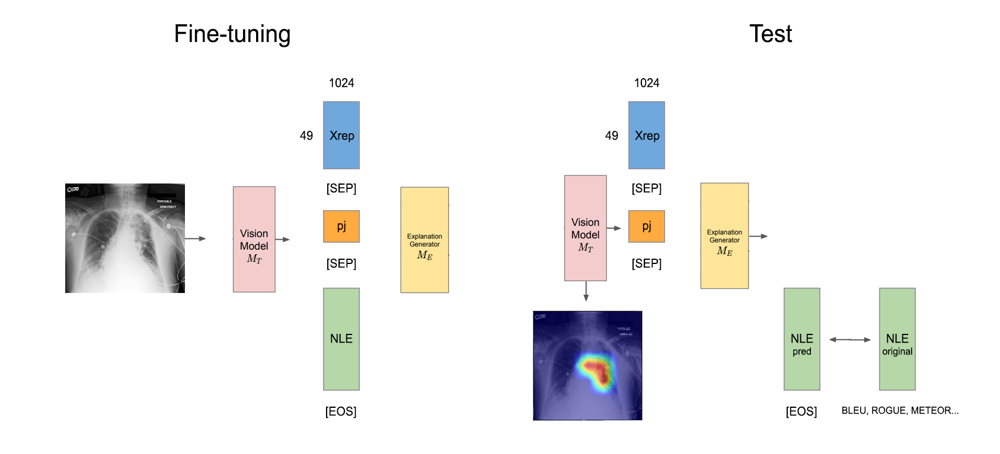
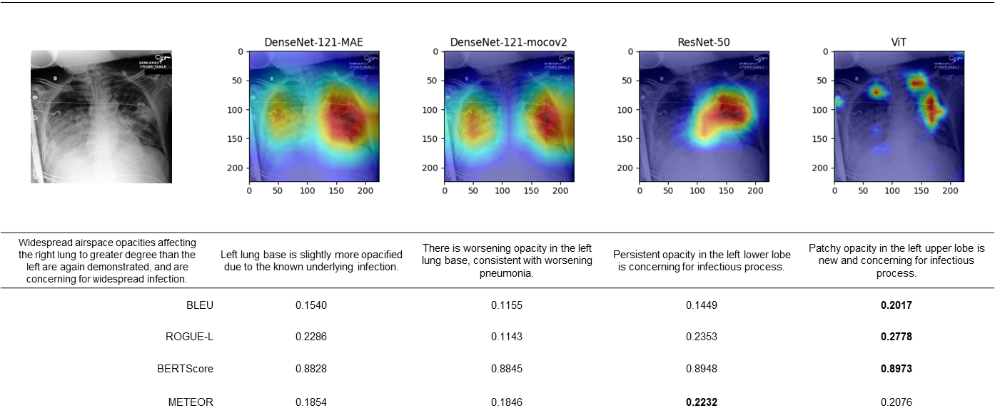

<!-- PROJECT LOGO -->
 

    <h2 align="center">Chest X-ray Image 진단 모델의 자연어 기반 판단 근거 설명 연구</h2>
    <h5>KHU Capstone Design Project / KI JUNG HWANG</h5>

  

<!-- ABOUT THE PROJECT -->
## Abstract
본 연구는 Chest X-ray image 대한 pathology classificaion에 있어 AI model의 판단을 설명하는 측면에 집중하여, 다양한 vision model이 압축하는 feature가 NLE 생성에 미치는 영향과 성능을 평가한다. Vision model은 CNN과 Transformer-based model인 포함한 세 종류(DenseNet, ResNet, ViT)의 모델을 비교하였으며, 같은 데이터셋으로 학습하였으나 다른 학습 방법을 사용한 시각 모델(DenseNet-MAE, DenseNet-MoCov2) 간에도 비교를 수행하였다. 자연어 생성 모델은 GPT-2-medium을 사용하였으며, 생성된 자연어 설명 문장의 품질은 BLEU, ROUGE-L, BERTScore, METEOR로 평가하였다.

(<a href="#readme-top">back to top</a>)

## Background
AI의 판단을 설명할 수 있는 XAI (eXplainable Artificial Intelligence)의 중요성은 의료 분야에서 환자의 안전 및 신뢰성 있는 진단을 위하여 중요하다. MIMIC-CXR, NIH Chest X-ray, CheXpert 등의 대규모 데이터셋을 통해 다양한 종류의 vision model이 pathology classificaion task에 적용되어 왔으며, Chest X-ray image를 진단하는 자연어 설명(Natural Language Explanation; NLE) 생성 task를 위한 언어 모델 및 데이터셋도 개발되고 있다.

(<a href="#readme-top">back to top</a>)

## Objectives
본 연구에서는 흉부 X선 사진에 따른 병리(Pathology) 예측에 있어 AI 모델의 판단을 설명하는 측면에 집중하여, 여러 시각 처리 모델이 분류를 위해 압축하는 특징(feature)이 NLE 생성에 미치는 영향과 성능을 평가한다. 또한, 분류 시에 시각 모델의 Grad-CAM 이미지와 생성된 NLE 문장이 일관된 판단을 내리는지 확인한다.

(<a href="#readme-top">back to top</a>)

## Study Design

### Dataset
- MIMIC-CXR-JPG (<a href="https://physionet.org/content/mimic-cxr-jpg/2.0.0/">link</a>)
- MIMIC-NLE Dataset (<a href="https://github.com/maximek3/MIMIC-NLE">link</a>) 

| Training | Validation | Test  | Total |
| :---: | :----------------: | :----: | :--: |
| 37,016 | 273 | 714 | 38,003 |

### Baseline Models
| Model | Pretrained Dataset | Method | mAUC |
| :---: | :----------------: | :----: | :--: |
| DenseNet-121 | X-rays (0.3M) | MoCo v2 | 80.6 |
| DenseNet-121 | X-rays (0.3M) | MAE | 81.2 |
| ResNet-50 | ImageNet | SwAV | 81.5 |
| ViT-Small/16 | X-rays (0.3M) | MAE | 82.3 |

- DenseNet-121-MAE, ResNet-50, ViT-Small/16 은 다른 모델 간 비교
- DenseNet-121-MAE, DenseNet-121-MoCov2는 다른 method로 학습한 같은 모델 간 비교

### Training
224\*224로 resize된 이미지를 Vision model에 투입하여 last layer(CNN : 4th block, ViT : 12th Block)에서 추출한 7\*7\*1024의 image representation을 49\*1024의 token sequence로 변환한다. 이를 [SEP] 토큰으로 pathology와 해당하는 NLE와 연결하여 GPT-2를 fine-tuning한다.
- optimizer : AdamW
- lr : 5E-4
- batch size : 16

### Evaluation
- BLEU-1, BLEU-4
- ROUGE-L
- BERTScore
- METEOR

(<a href="#readme-top">back to top</a>)

## Result
|  | BLEU-1 | BLEU-4 | ROUGE-L | BERTScore | METEOR |
| :---: | :----------------: | :----: | :--: | :--: | :--: |
| DenseNet-MoCov2 | 0.1546 | 0.0086 | 0.2059 | 0.8799 | 0.2362 |
| DenseNet-MAE | 0.1548 | 0.0141 | 0.2083 | 0.8812 | 0.2385 |
| ResNet-50 | 0.1607 | <b>0.0182</b> | 0.2179 | 0.8820 | 0.2438 |
| ViT | <b>0.1656</b>| 0.0121 | <b>0.2249</b> | <b>0.8828</b> | <b>0.2491</b> |

NLE 생성 품질 측면에서 ViT가 5개의 평가 지표 중 4개에서 가장 높은 점수를 기록하였으며, 모델의 분류 성능과 동일하게  ViT > ResNEt-50 > DenseNet-121를 따른다. DenseNet-MAE와 DenseNet-MoCov2는 모든 평가 지표에서 DenseNet-MAE가 근소하게 높다. 즉, 시각 모델에서 분류에 사용된 Chest X-ray의 압축된 feature들이 분류 문제에서 그러하였듯 자연어 설명(NLE) 생성에서도 유리한 feature로 작용하는 것으로 보인다.

윗 이미지는 폐렴(pneumonia) 환자의 Chest X-ray 예시로, 4개의 모델이 각각 분류에서 어떤 판단을 내렸는지 투사하는 Grad-CAM 이미지와 압축된 feature로 생성된 자연어 설명과 각각의 NLE 평가 지표들을 요약하였다. 원 이미지 및 진단 문장에서 좌우측 폐의 airspace opacity를 판단 기준으로 widespread infection을 우려하고 있는 점과 유사하게, Grad-CAM 이미지에서 네 모델 모두 공통적으로 left lung을 판단 근거로 사용한다. 예측된 NLE에서도 모두 공통적으로 left lung의 opacity에 의해 infection 또는 pneumonia가 진단된다고 언급하며, Grad-CAM에서와 판단 근거를 일관되게 기술하고 있다. 전체적인 NLE의 품질은 ViT가 BLEU, ROUGE-L, BERTScore에서 가장 높으며, ResNet-50이 METEOR에서는 가장 높게 나타났다.

(<a href="#readme-top">back to top</a>)

## Discussion

GPT-2는 RATCHET 및 TieNet 등 Chest X-ray의 설명 생성에 특화된 언어 모델들보다 모델의 크기가 크고 일상적 언어 위주의 데이터셋으로 학습되어 NLE의 품질이 비교적 낮으며, 전용 언어 모델을 사용할 경우 더 의학적인 NLE를 생성할 수 있을 것이다. 또한, 시각 모델을 더욱 다양하게 비교 (학습 데이터셋은 동일하나 방법이 다른 모델간 비교, 학습 데이터셋이 다르고 방법이 다른 모델간의 비교, ViT-Small과 ViT-Base의 비교, patch size(16, 32)에 따른 비교) 하는 방법도 고려해볼만한 추후 연구 방향이다.

Chest X-ray image의 설명으로서의 NLE는 구문적 불일치보다 의미적 오류를 지닐 때 더욱 치명적이다. 가령, 올바른 pathology를 진단했더라도 잘못된 근거를 들어 판단했다면 의미가 먼 단어를 사용한 것보다 더 큰 penalty가 필요하다. 즉, 구문적 일치성만을 검사하는 다른 metric들과 달리 의미적으로는 틀린 설명을 올바르게 측정할 정밀한 지표의 도입이 필요하다.

MIMIC-CXR 데이터셋의 원 자연어 소견 데이터는 더 많은 문장과 맥락을 포함하고 있으며 labeler에 의해 추출된 문장의 의미적 대표성을 객관화할 지표가 부족하다. 즉, 학습 데이터의 전반적인 질이 labeler의 성능에 달려있기에 올바른 NLE 생성 모델을 만드려면 종합적인 의미를 올바르게 요약하는 labeler의 성능 개선이 수반되어야 한다.

(<a href="#readme-top">back to top</a>)

## References
[1] X. Wang, Y. Peng, L. Lu, Z. Lu, and R. M. Summers. Tienet: Text-image embedding network for common thorax disease classification and reporting in chest x-rays. In 2018 IEEE/CVF Conference on Computer Vision and Pattern Recognition (CVPR), pages 9049–9058, Los Alamitos,CA, USA, jun 2018. IEEE Computer Society.

[2] Andrew B Rosenkrantz, Danny R Hughes, and Richard Duszak Jr. The us radiologist workforce: an analysis of temporal and geographic variation by using large national datasets. Radiology, 279(1):175–
184, 2016.

[3] Junfei Xiao, Yutong Bai, Alan Yuille, and Zongwei Zhou. Delving into masked autoencoders for multi-label thorax disease classification. In Proceedings of the IEEE/CVF Winter Conference on Applications of Computer Vision, pages 3588–3600, 2023.

[4] Maxime Kayser, Cornelius Emde, Oana Camburu, Guy Parsons, Bartlomiej Papiez, and ThomasLukasiewicz. Explaining chest x-ray pathologies in natural language. In Proceedings of the 25th International Conference on Medical Image Computing and Computer-Assisted Intervention, MICCAI 2022, Singapore, 18–22 September 2022, Lecture Notes in Computer Science (LNCS). Springer, September 2022.

[5] Alistair E. W. Johnson, Tom J. Pollard, Nathaniel R. Greenbaum, Matthew P. Lungren, Chih ying Deng, Yifan Peng, Zhiyong Lu, Roger G. Mark, Seth J. Berkowitz, and Steven Horng. Mimic-cxr-jpg, a large publicly available database of labeled chest radiographs, 2019.

[6] Kishore Papineni, Salim Roukos, Todd Ward, and Wei-Jing Zhu. Bleu: a method for automatic evaluation of machine translation. In Annual Meeting of the Association for Computational Linguistics, 2002.

[7] Chin-Yew Lin. ROUGE: A package for automatic evaluation of summaries. In Text Summarization Branches Out, pages 74–81, Barcelona, Spain, July 2004. Association for Computational Linguistics.

[8] Tianyi Zhang, Varsha Kishore, Felix Wu, Kilian Q. Weinberger, and Yoav Artzi. Bertscore: Evaluating text generation with bert, 2020.

[9] Alon Lavie and Abhaya Agarwal. Meteor: An automatic metric for mt evaluation with high levels of correlation with human judgments. pages 228–231, 07 2007.

(<a href="#readme-top">back to top</a>)
